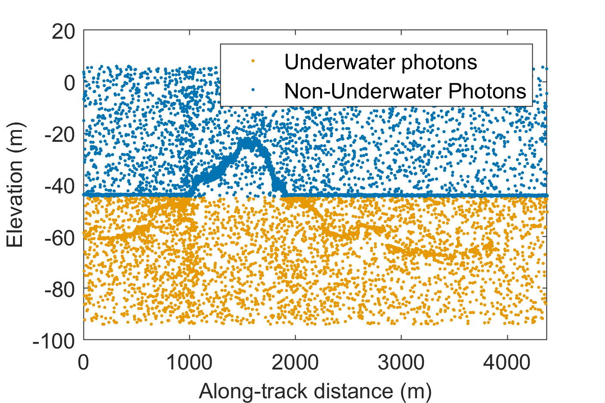
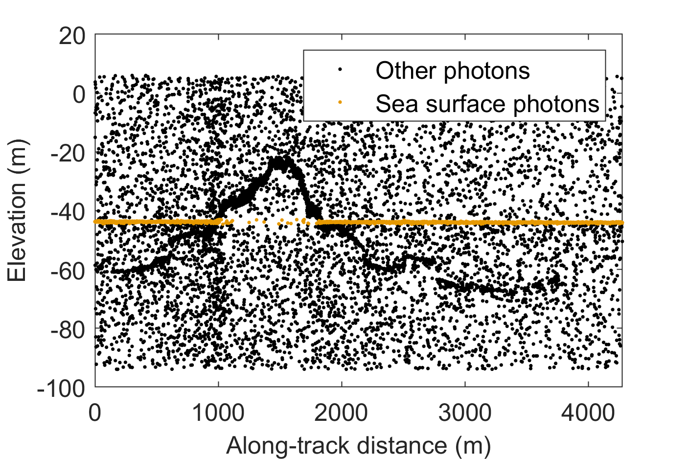
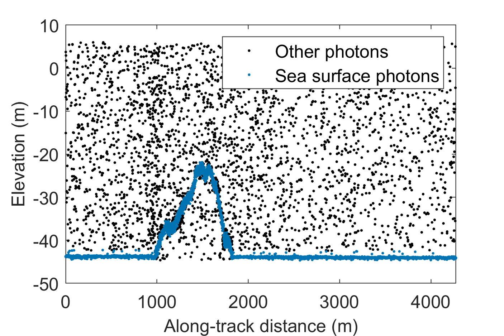
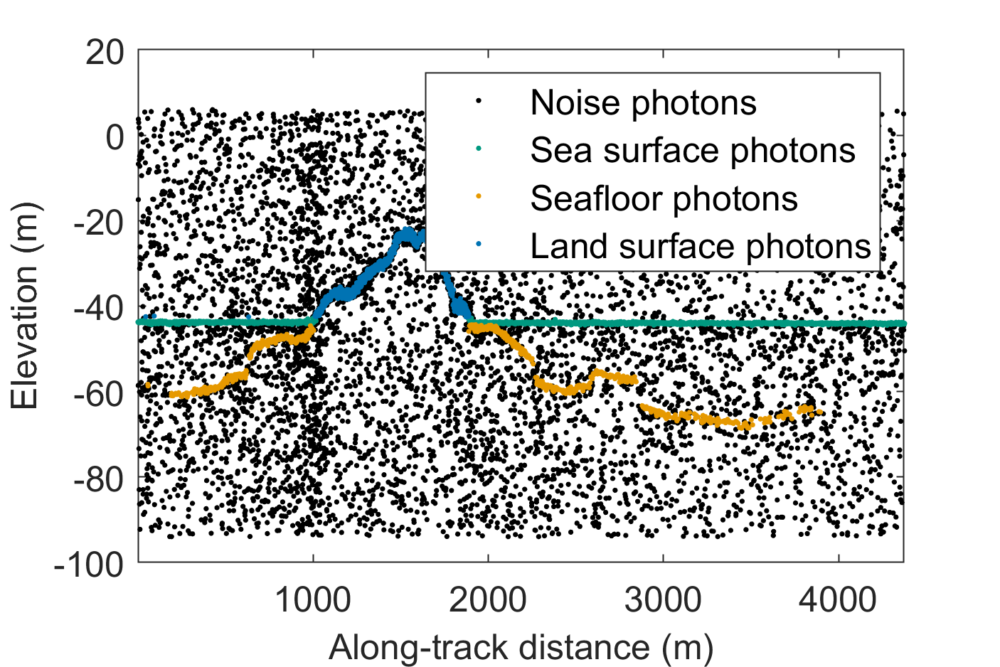
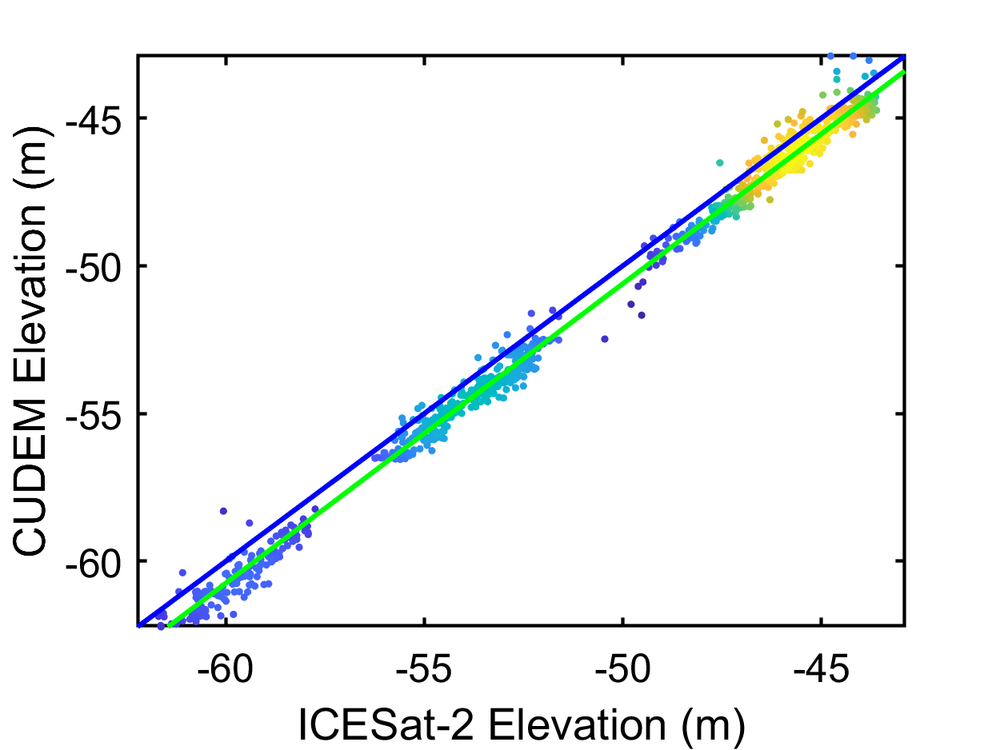
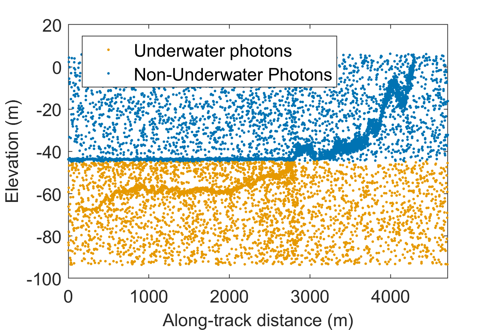
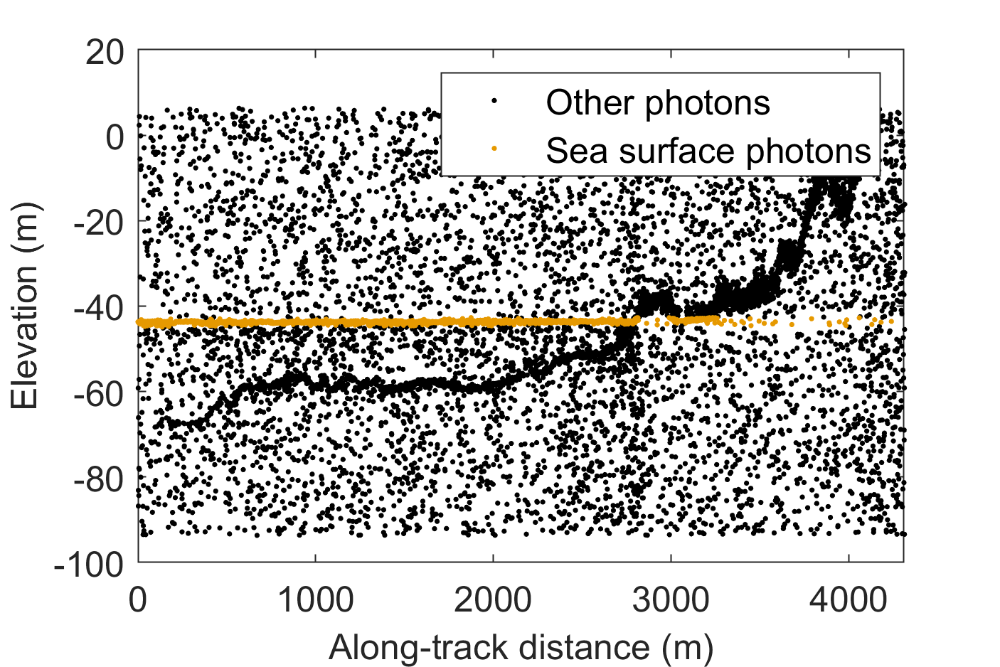
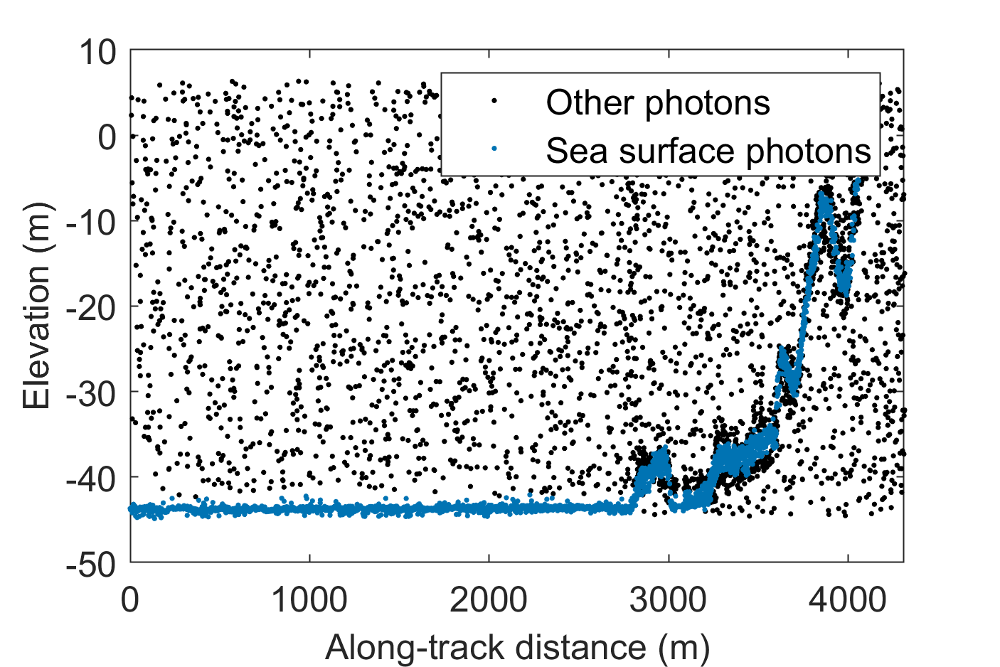
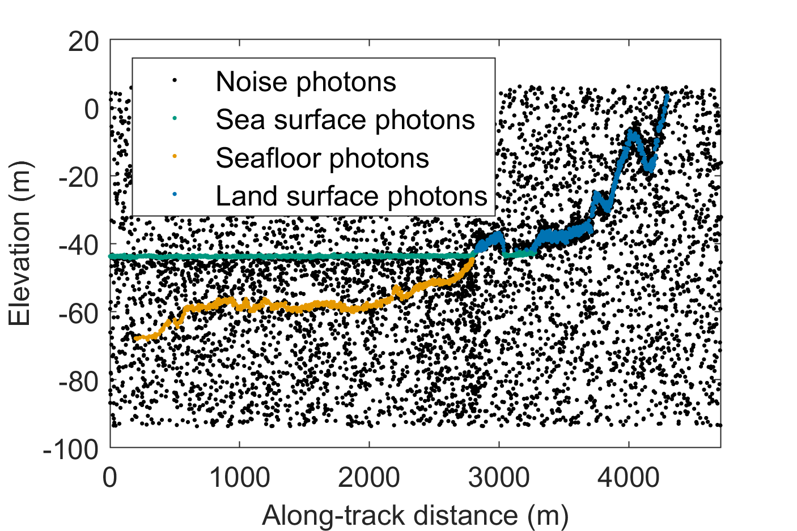
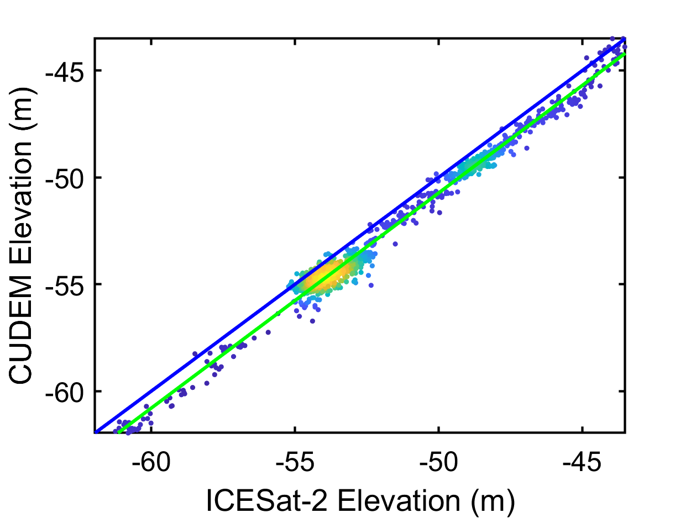

# LFSPE-ICESat2-Bathymetry
This repository provides the implementation of the **Linear Feature-Based Signal Photon Extraction (LFSPE)** algorithm for shallow-water bathymetry using ICESat-2 ATL03 photon-counting data.

The method is designed to improve signal photon identification accuracy and robustness across varying water depths and noise conditions by leveraging linear feature characteristics and adaptive parameter strategies.

ICESat-2 and validation data
--------------
📥 Download full datasets from Google Drive:
🔗 [ICESat-2 and validation data](https://drive.google.com/drive/folders/1RTBe8tc0kQiUXllJGJ4sMKz0Mpm5O1TD?usp=drive_link)


Example
--------------
Run in Matlab: demo_extract_powerline.m
```matlab
1. Open **MATLAB** (R2022a or later recommended).
2. Set your current working directory to the root of this project.
3. Execute the main script:
   run_bathymetry
```

📄 License
--------------
This code is released for academic and non-commercial use only.
For commercial licensing or extended use, please contact the authors.

📧 Contact
--------------
For questions, feedback, or collaboration inquiries, please contact:
📨 Zhenwei Shi: shizw@aircas.ac.cn

Results
--------------











