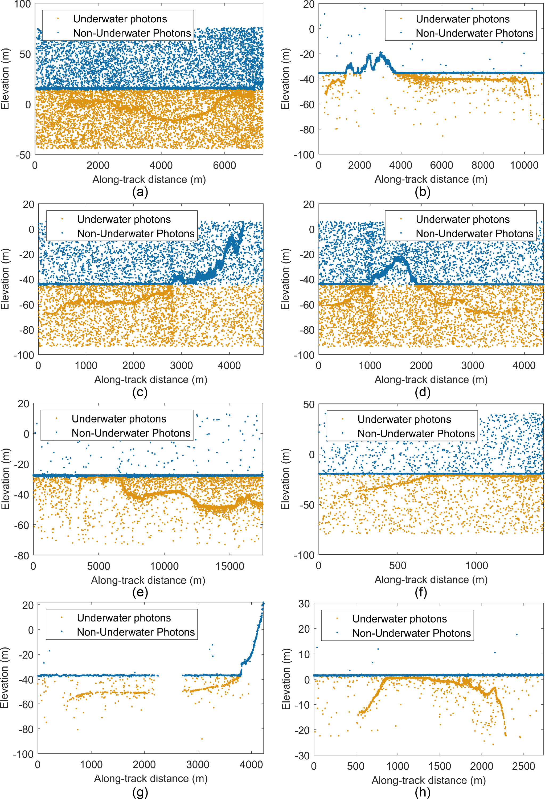
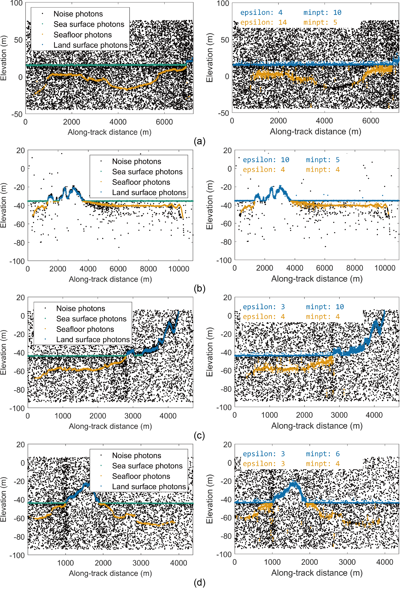
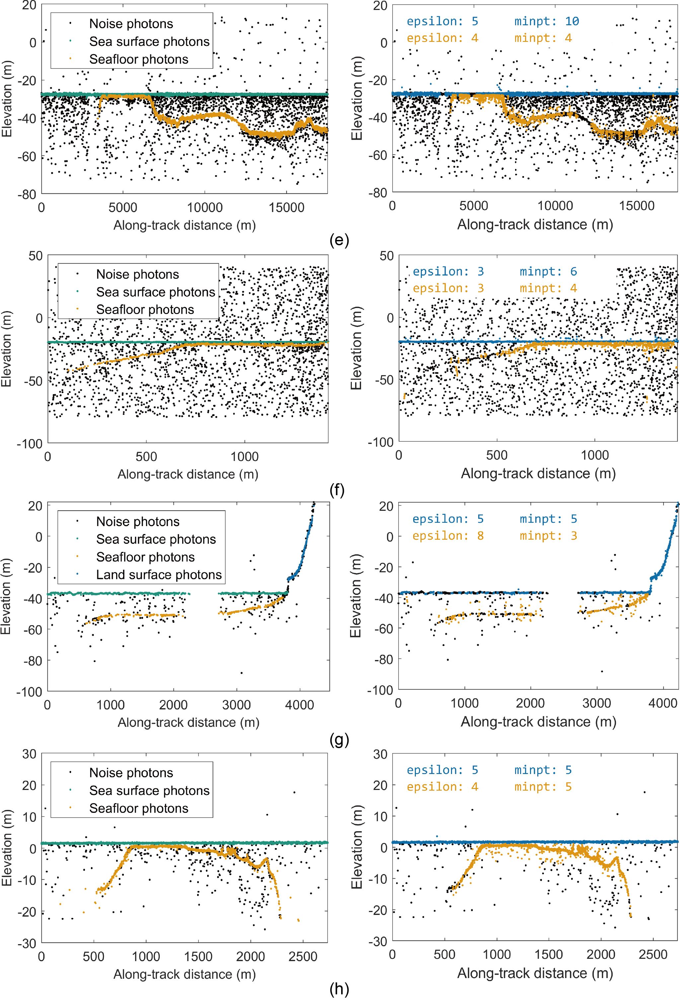

# LFSPE-ICESat2-Bathymetry

This repository provides the official MATLAB implementation of the **Linear Feature-Based Signal Photon Extraction (LFSPE)** algorithm for shallow-water bathymetry using ICESat-2 ATL03 photon-counting LiDAR data, as proposed in:

> **Shi, Z., Li, J., Yang, Z., Long, H., Cui, H., Zhao, S., Li, X., Li, Q. (2025). A Linear Feature-Based Method for Signal Photon Extraction and Bathymetric Retrieval Using ICESat-2 Data. Remote Sensing, 17(16), 2792.**  
> [https://doi.org/10.3390/rs17162792](https://doi.org/10.3390/rs17162792)

---

## 🔍 Overview

The **LFSPE** algorithm improves signal photon identification accuracy and robustness across varying water depths and noise conditions by:

- **Adaptive resolution adjustment** (vertical & horizontal) to standardize photon spacing  
- **Segmented Gaussian fitting** to separate underwater and non-underwater photons  
- **Linear feature analysis** with a depth-dependent adaptive neighborhood radius  
- **Refraction correction** for accurate bathymetric depth retrieval  

**Performance Highlights** (vs. DBSCAN):

| Metric     | LFSPE  | DBSCAN |
|:----------:|:------:|:------:|
| Precision  | **0.977** | 0.751  |
| Recall     | **0.958** | 0.817  |
| F1 Score   | **0.967** | 0.778  |
| OA         | **0.972** | 0.796  |

---

## 📂 Data Sources

- **ICESat-2 ATL03 data** – Download from [NASA Earthdata Search](https://search.earthdata.nasa.gov)  
- **CUDEM Bathymetric Data** – Download from [NOAA NGDC](https://www.ngdc.noaa.gov/mgg/bathymetry/bathymetry.html)  
- **Full experimental datasets from the paper** – [Google Drive Link](https://drive.google.com/drive/folders/1RTBe8tc0kQiUXllJGJ4sMKz0Mpm5O1TD?usp=drive_link)  

---

## 🛠 Requirements

- MATLAB **R2022a** or later  
- **Mapping Toolbox** (for geospatial visualization)  
- **Statistics and Machine Learning Toolbox** (for RANSAC fitting)  

---

## 🚀 Usage

### Run Bathymetry Extraction
```matlab
% 1. Open MATLAB (R2022a or later recommended)
% 2. Set the current working directory to the root of this project
% 3. Execute:
run_bathymetry

---

## 📄 License
This code is released for academic and non-commercial use only.
For commercial licensing or extended use, please contact the authors.

## 📧 Contact
For questions, feedback, or collaboration inquiries, please contact:
📨 Zhenwei Shi: shizw@aircas.ac.cn

## Results



